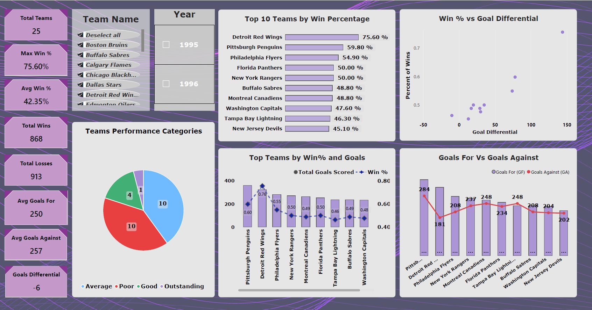

# Hockey Team Performance Analysis

An end-to-end data analytics project that collects hockey team data from the web, prepares and validates the dataset, performs performance analysis, and presents the results through an interactive Power BI dashboard.

## Project Overview

This project demonstrates a complete analytics workflow:

**Web Scraping → Data Preparation → Data Transformation → Data Validation → Exploratory Analysis → KPI Development → Power BI Visualisation → Insights**

The project uses hockey team performance data to explore winning percentage, goals scored, goals conceded, goal differential, and overall team performance.

## Dashboard Preview



The Power BI dashboard includes:

- Total Teams
- Maximum Win %
- Average Win %
- Total Wins
- Total Losses
- Average Goals For
- Average Goals Against
- Goal Differential
- Top 10 Teams by Win Percentage
- Win % vs Goal Differential
- Team Performance Categories
- Win % and Goals comparison
- Goals For vs Goals Against
- Team and Year slicers for interactive filtering

## Key Questions

The analysis focuses on questions such as:

- Which teams have the highest winning percentages?
- How does goal differential relate to winning percentage?
- Which teams score the most goals?
- Which teams concede the most goals?
- How do goals scored and goals conceded compare across teams?
- How are teams distributed across performance categories?

## Key Findings

Based on the supplied dataset:

- **Detroit Red Wings** recorded the highest Win % at **75.6%**.
- **Pittsburgh Penguins** recorded the highest Goals For with **362 goals**.
- **Ottawa Senators** recorded the lowest Win % at **22.0%**.
- **San Jose Sharks** had the highest negative Goal Differential at **-105**.
- Goal Differential and Win % show a strong positive association in the supplied observations, with a correlation of approximately **0.97**.
- Goals For and Win % show a positive association, with a correlation of approximately **0.69**.
- Goals Against and Win % show a negative association, with a correlation of approximately **-0.72**.

These relationships describe the supplied observations and should not be interpreted as proof of causation.

## Performance Categories

The final Power BI dashboard groups teams into four performance categories:

- **Poor:** 10 teams
- **Average:** 10 teams
- **Good:** 4 teams
- **Outstanding:** 1 team

These are the category labels and counts displayed in the final dashboard.

## Tools & Technologies

- **Python**
- **Requests**
- **BeautifulSoup**
- **Pandas**
- **Jupyter Notebook**
- **Excel / CSV**
- **Power Query**
- **Power BI**

## Data Workflow

### 1. Web Scraping

Python was used to retrieve hockey team data from a web page and extract structured information from the HTML.

### 2. Data Preparation

The scraped information was converted into a structured dataset containing team performance measures such as:

- Team Name
- Year
- Wins
- Losses
- OT Losses
- Win %
- Goals For (GF)
- Goals Against (GA)
- Goal Differential

### 3. Data Transformation

Additional analysis fields were created, including Total Matches played by team, Goals For Per Game, Goals Against Per Game, Goal Differtial Category and Performance Category.

### 4. Data Validation

The dataset was checked for valid numeric values, reasonable Win % values, and consistency across the main performance fields.

### 5. Power BI Analysis

The prepared data was loaded into Power BI and used to create KPI cards, ranking charts, comparison charts, a scatter plot, a performance-category chart, and interactive slicers.

## Repository Structure

```text
Hockey_Team_Performance_Analysis/
│
├── README.md
├── requirements.txt
├── .gitignore
│
├── data/
│   ├── Hockey_Teams.xlsx
│   └── Hockey_Teams.csv
│
├── notebooks/
│   └── web_scraping_hockey_teams.ipynb
│
├── powerbi/
│   └── Hockey_Team_Performance_Dashboard.pbix
│
└── docs/
    ├── Analysis_and_Key_Insights.md
    ├── Data_Dictionary.md
    ├── Portfolio_Project_Summary.md
    ├── Dashboard_Review.md
    └── PowerBI_Dashboard_Screenshot.png
```

## Skills Demonstrated

- Web Scraping
- Python
- HTML Parsing
- Data Extraction
- Data Cleaning
- Data Transformation
- Data Validation
- Exploratory Data Analysis
- KPI Development
- Data Visualisation
- Power Query
- Power BI
- Dashboard Design
- Analytical Storytelling

## Project Limitations

The project is based on the supplied hockey dataset and is intended as a portfolio analytics project.

The original scraped dataset has limitations, including incomplete information for some fields such as OT Losses. The analysis therefore focuses on the fields available in the supplied data.

The correlation figures describe relationships within the available observations and do not establish causal relationships.

## Future Improvements

Possible extensions include:

- Scraping multiple seasons automatically
- Handling pagination dynamically
- Adding automated data-quality checks
- Expanding the analysis across multiple seasons
- Adding team-level performance trends
- Creating additional player-level analysis
- Automating the refresh and reporting workflow


## Portfolio Summary

This project demonstrates an end-to-end approach to turning raw web data into an interactive analytical product.

**I collected raw data from the web, transformed it into analysis-ready data, validated the data, developed performance metrics, analysed relationships between scoring and winning, and communicated the results through an interactive Power BI dashboard.**
